# Solución de Arquitectura de Datos para el Desafío Técnico Alegra

Este repositorio presenta una solución completa al desafío técnico de un Ingeniero de Datos, ambientado en un entorno de simulación profesional. La arquitectura implementada emula un ecosistema productivo compuesto por un Data Warehouse modelado en esquema **copo de nieve**, y un pipeline ETL modular construido en **PySpark**, ejecutado dentro de un entorno **Dockerizado**.

### Contexto del Entorno Alegra

El entorno simulado representa una arquitectura tipo **Lakehouse**, caracterizada por zonas de almacenamiento diferenciadas (`bronze`, `silver`, `gold`). Adicionalmente, se incluye un contenedor de **SQL Server** que funge como el sistema transaccional OLTP de origen.

Es importante destacar que los datos de entrada no se obtienen directamente del contenedor SQL, sino que se alojan inicialmente en la carpeta `data_source/`. Desde esta ubicación, los datos atraviesan las siguientes etapas en el pipeline:

1. **Zona Bronze**: Los datos se cargan sin transformaciones, manteniendo su estructura original.
2. **Zona Silver**: Se aplican procesos de limpieza, normalización y modelado de datos conforme al esquema **Copo de Nieve**.
3. **Zona Gold**: Se generan las vistas analíticas o tablas agregadas necesarias para responder a las **métricas de negocio** solicitadas en la prueba técnica.

Este enfoque promueve una clara separación entre los niveles de calidad de los datos, garantiza la **trazabilidad** y facilita la **escalabilidad** futura mediante la integración con catálogos de datos externos, motores SQL o herramientas de Business Intelligence.

---

# Consideraciones Técnicas y Respuestas al Desafío

* El módulo `src/` fue diseñado para soportar múltiples negocios. Actualmente se implementa el flujo para `innova`, pero es totalmente **escalable**: basta con añadir otra subcarpeta por negocio y configurar su `etl_config.yml`.
* El pipeline **no se diseñó como pseudocódigo**, sino como un **código funcional y preparado para producción**, soportando orquestación por pasos (`step_01` a `step_03`), carga incremental y trazabilidad total mediante metadatos y logs persistentes.
* La complejidad del modelo se refleja no solo en su diseño copo de nieve, sino en la infraestructura implementada:

  * Procesamiento con **Spark**.
  * Carga final a un modelo en **SQL Server** embebido en contenedor, incluyendo configuración de **drivers JDBC**.
  * Implementación de clases reutilizables que automatizan el `upsert` con plantillas `MERGE`.
* **Plan de ETL:**

  1. **Ingesta cruda** desde `data_source/` → zona `bronze`.
  2. **Transformación estructural** y casting → `silver` (staging).
  3. **Carga del DWH**: poblar dimensiones y hechos respetando orden de dependencias.
  4. **Consultas analíticas** sobre zona `gold` con métricas definidas por la prueba.
* **Innovación:** uso de Spark local en un entorno aislado (contenedor Jupyter + Spark + SQLServer), demostrando habilidades prácticas de despliegue y desarrollo modular.

---

### Requisitos del Entorno

Para ejecutar la solución propuesta, asegúrese de tener instaladas las siguientes herramientas:

* Python 3.10+
* pip
* Virtualenv (`python -m venv`)
* Docker (para la instancia simulada de SQL Server)
* PySpark (utilizado en los notebooks)
* JupyterLab o VSCode (para desarrollo con notebooks)
* Java Development Kit (JDK)

### Configuración del Entorno

Siga estos pasos para configurar y preparar el entorno de desarrollo:

1. **Clonar el Repositorio:**

   ```bash
   git clone https://github.com/usuario/data-engineer-health-assessment.git
   cd data-engineer-health-assessment
   ```
2. **Crear y Activar el Entorno Virtual:**

   ```bash
   python -m venv venv
   source venv/bin/activate  # Para Linux/macOS
   # Para Windows: .\venv\Scripts\activate
   ```
3. **Instalar Dependencias:**

   ```bash
   pip install -r requirements.txt
   ```
4. **Instalar OpenJDK 11 (Recomendado para Spark 3.x):**

   ```bash
   sudo apt update
   sudo apt install openjdk-11-jdk -y
   ```

   *Nota: Los comandos pueden variar para otros sistemas operativos (Windows, macOS).*
5. **Ubicar la Ruta de Java Home:**

   ```bash
   readlink -f $(which java)
   ```

   Este comando proporcionará la ruta completa de su instalación de Java, la cual será necesaria en el siguiente paso.
6. **Configurar la Variable de Entorno `JAVA_HOME`:**

   Edite su archivo de configuración del shell (por ejemplo, `.bashrc` para Linux o `.zshrc` para Zsh/PowerShell) y añada las siguientes líneas al final:

   ```bash
   # Ejemplo con nano para .zshrc
   nano ~/.zshrc
   ```

   Añada al final del archivo:

   ```bash
   export JAVA_HOME="[ruta_obtenida_en_el_paso_anterior]"
   export PATH=$JAVA_HOME/bin:$PATH
   ```

   *Asegúrese de reemplazar `[ruta_obtenida_en_el_paso_anterior]` con la ruta real que obtuvo en el paso 5.*
7. **Aplicar los Cambios al Shell:**

   ```bash
   source ~/.zshrc # O el archivo de configuración de su shell
   ```
8. **Verificar la Instalación de PySpark:**

   ```bash
   python -c "from pyspark.sql import SparkSession; print(SparkSession.builder.master('local[*]').getOrCreate().version)"
   ```

   Si la configuración es correcta, verá una salida similar a esta (puede haber advertencias de WARN):

   ```
   25/04/23 00:55:28 WARN Utils: Your hostname, NicoNavarro resolves to a loopback address: 127.0.1.1; using 10.255.255.254 instead (on interface lo)
   25/04/23 00:55:28 WARN Utils: Set SPARK_LOCAL_IP if you need to bind to another address
   Setting default log level to "WARN". To adjust logging level use sc.setLogLevel(newLevel). For SparkR, use setLogLevel(newLevel).
   25/04/23 00:55:29 WARN NativeCodeLoader: Unable to load native-hadoop library for your platform... using builtin-java classes where applicable
   3.4.1
   ```
9. **(Opcional) Configuración de Variables de Entorno:**
   Si utiliza variables de entorno para rutas, puertos, etc., cree un archivo `.env` basado en el `.env.example` proporcionado en el repositorio.
10. **Iniciar el Contenedor de SQL Server:**

    ```bash
    cd sql_server
    docker-compose up -d
    ```
11. **Levantar los Notebooks para Desarrollo:**

    ```bash
    jupyter lab  # O utilice VSCode con la extensión de Jupyter
    ```

Al final ejecutando desde spark_docker: `docker compose --env-file ../.env up --build` construirá los contenedores y dejará la base de datos lista para utilizarse y conectarse a ella mediante cualquier IDE, en mi caso utilicé Dbeaver:

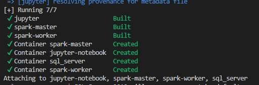

# Modelo de Datos Propuesto

El modelo de datos implementado sigue una estructura de **copo de nieve (snowflake)**, una elección adecuada para entornos que requieren una alta normalización de las dimensiones. Esto permite mantener los datos limpios, estructurados y fácilmente escalables para futuras necesidades analíticas.

El modelo se centra en la tabla de hechos `fact_invoices`, que captura la granularidad de cada línea de factura (producto vendido por cliente en una fecha específica). Esta tabla se relaciona con diversas tablas de dimensión: `dim_customer`, `dim_product`, `dim_time`, y sus respectivas jerarquías normalizadas.

#### Diagrama del Modelo


#### Tablas del Modelo

A continuación, se detalla la estructura de las tablas que componen el Data Warehouse:

##### Tabla de Hechos: `fact_invoices`

| Columna          | Tipo         | Descripción                                           |
| :--------------- | :----------- | :----------------------------------------------------- |
| `id`           | `INT`      | Identificador único de la transacción (PK)           |
| `id_customer`  | `INT`      | Cliente que realizó la compra (FK a `dim_customer`) |
| `id_product`   | `INT`      | Producto vendido (FK a `dim_product`)                |
| `id_date`      | `INT`      | Fecha de la factura (FK a `dim_time`)                |
| `quantity`     | `INT`      | Número de unidades vendidas                           |
| `total_amount` | `FLOAT`    | Valor total de la transacción                         |
| `created_at`   | `DATETIME` | Fecha de creación del registro                        |
| `updated_at`   | `DATETIME` | Última actualización del registro                    |
| `deleted_at`   | `DATETIME` | Marca de eliminación lógica (si aplica)              |


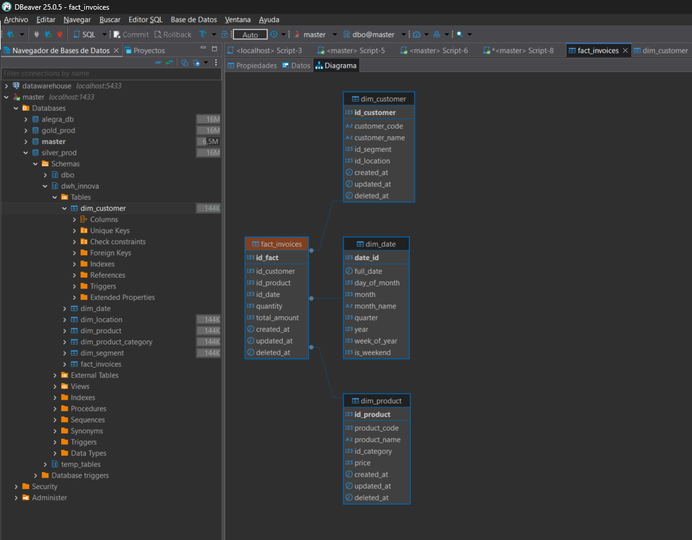

##### Tablas de Dimensión:

###### **`dim_customer`**

| Columna         | Tipo         | Descripción                                      |
| :-------------- | :----------- | :------------------------------------------------ |
| `id`          | `INT`      | Identificador único del cliente (PK)             |
| `name`        | `TEXT`     | Nombre completo del cliente                       |
| `id_location` | `INT`      | Localización del cliente (FK a `dim_location`) |
| `id_segment`  | `INT`      | Segmento del cliente (FK a `dim_segment`)       |
| `created_at`  | `DATETIME` | Fecha de creación                                |
| `updated_at`  | `DATETIME` | Fecha de actualización                           |
| `deleted_at`  | `DATETIME` | Eliminación lógica                              |

****

###### **`dim_location`**

| Columna        | Tipo         | Descripción                                   |
| :------------- | :----------- | :--------------------------------------------- |
| `id`         | `INT`      | Identificador único de región/localidad (PK) |
| `name`       | `TEXT`     | Nombre de la región                           |
| `created_at` | `DATETIME` | Fecha de creación                             |
| `updated_at` | `DATETIME` | Fecha de actualización                        |
| `deleted_at` | `DATETIME` | Eliminación lógica                           |

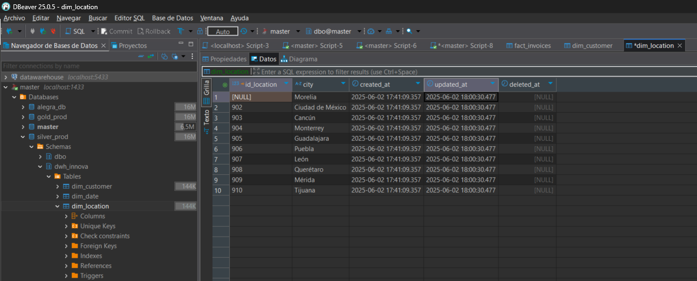

###### **`dim_segment`**

| Columna         | Tipo         | Descripción                                      |
| :-------------- | :----------- | :------------------------------------------------ |
| `id`          | `INT`      | Identificador único del segmento de cliente (PK) |
| `description` | `TEXT`     | Descripción del segmento                         |
| `created_at`  | `DATETIME` | Fecha de creación                                |
| `updated_at`  | `DATETIME` | Fecha de actualización                           |
| `deleted_at`  | `DATETIME` | Eliminación lógica                              |

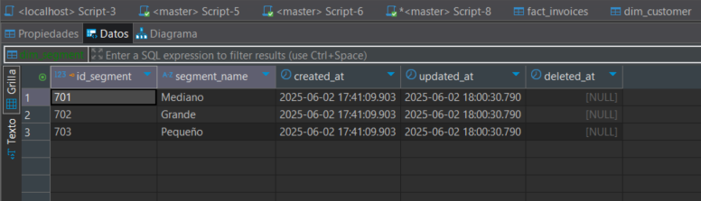

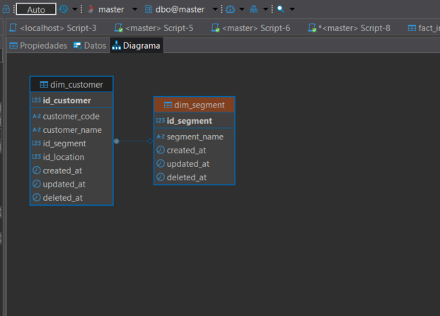

###### **`dim_product`**

| Columna         | Tipo         | Descripción                                            |
| :-------------- | :----------- | :------------------------------------------------------ |
| `id`          | `INT`      | Identificador único del producto (PK)                  |
| `name`        | `TEXT`     | Nombre del producto                                     |
| `id_category` | `INT`      | Categoría del producto (FK a `dim_product_category`) |
| `price`       | `FLOAT`    | Precio unitario del producto                            |
| `created_at`  | `DATETIME` | Fecha de creación                                      |
| `updated_at`  | `DATETIME` | Fecha de actualización                                 |
| `deleted_at`  | `DATETIME` | Eliminación lógica                                    |

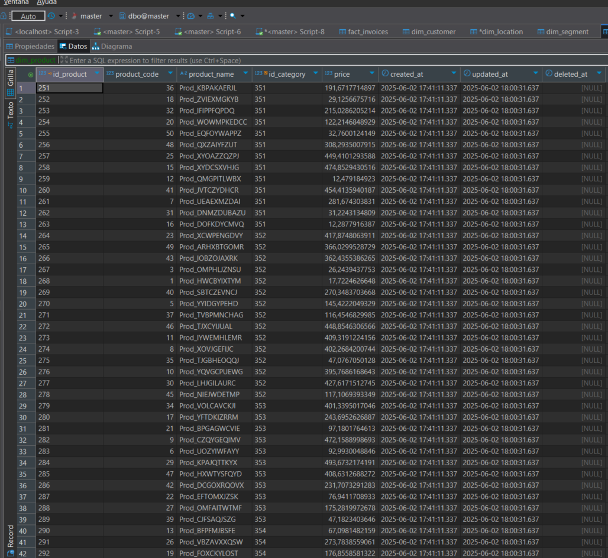

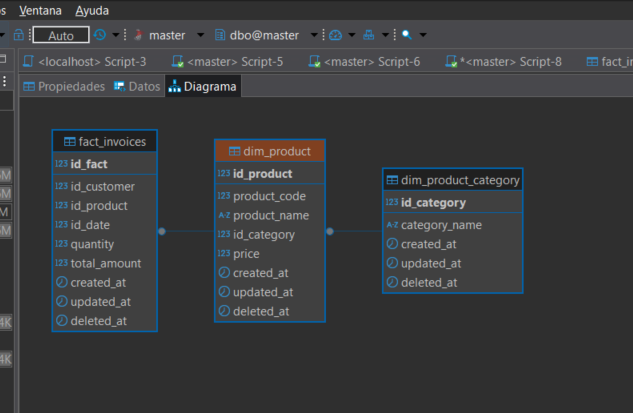

###### **`dim_product_category`**

| Columna        | Tipo         | Descripción                               |
| :------------- | :----------- | :----------------------------------------- |
| `id`         | `INT`      | Identificador único de la categoría (PK) |
| `name`       | `TEXT`     | Nombre de la categoría                    |
| `created_at` | `DATETIME` | Fecha de creación                         |
| `updated_at` | `DATETIME` | Fecha de actualización                    |
| `deleted_at` | `DATETIME` | Eliminación lógica                       |

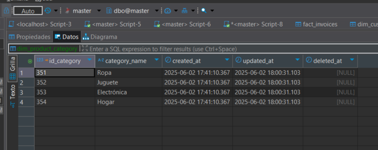

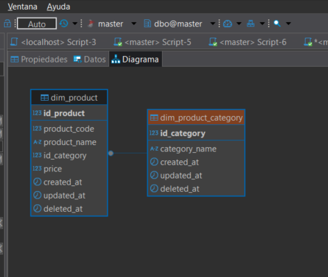

###### **`dim_date`**

| Columna         | Tipo     | Descripción                          |
| :-------------- | :------- | :------------------------------------ |
| `date_id`     | `INT`  | Identificador único de la fecha (PK) |
| `full_date`   | `DATE` | Fecha completa                        |
| `day`         | `INT`  | Día del mes                          |
| `month`       | `INT`  | Mes numérico                         |
| `month_name`  | `TEXT` | Nombre del mes                        |
| `quarter`     | `INT`  | Trimestre (1-4)                       |
| `year`        | `INT`  | Año calendario                       |
| `attribute_8` | `TEXT` | Campo reservado para extensiones      |

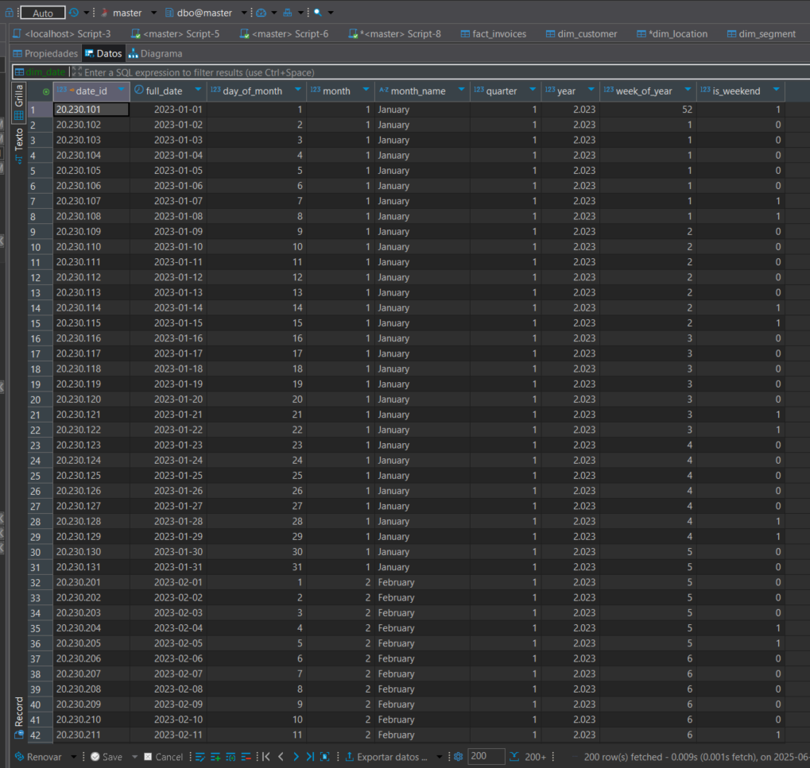

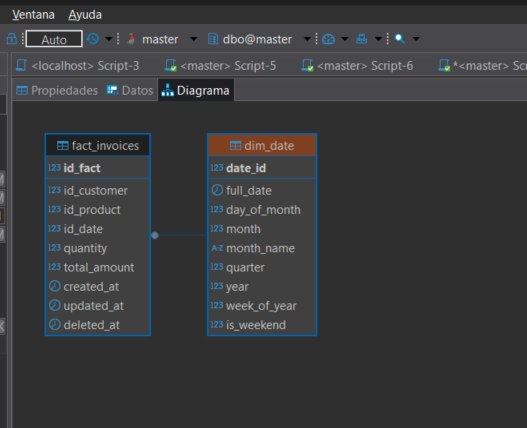

#### Granularidad

La tabla de hechos `fact_invoices` tiene una granularidad a nivel de línea de venta por producto, cliente y fecha. Esta granularidad permite un análisis detallado de los patrones de consumo, segmentado por cliente, categoría de producto y región geográfica.

#### Consultas de Análitica

Las consultas se realizaron directamente en la base de datos y por cuestiones de tiempo en implementación no se logró mostrar el resultado de las queries como tablas o vistas en **gold_prod.bi_innova.resultados_queries.** Sin embargo se propone implementar **dbt** o simplemente la configuración actual de ejecución de queries almacenando los resultados en el catalogo para BI.

##### ¿Cuál es el producto más vendido en cada trimestre del año?: Resultado en

```
data_lake/gold/bi_innova/top_selling_product_by_quarter.csv
```

```sql
WITH ranked_products AS (

  SELECT
    d.[year],
    d.quarter,
    p.product_name,
    SUM(f.quantity) AS total_quantity,
    ROW_NUMBER() 
      OVER (
        PARTITION BY d.[year], d.quarter 
        ORDER BY SUM(f.quantity) DESC
      ) AS rn
  FROM dwh_innova.fact_invoices AS f
    JOIN dwh_innova.dim_date AS d
      ON f.id_date = d.date_id
    JOIN dwh_innova.dim_product AS p
      ON f.id_product = p.id_product
  GROUP BY
    d.[year],
    d.quarter,
    p.product_name
)
SELECT
  [year],
  quarter,
  product_name,
  total_quantity
FROM ranked_products
WHERE rn = 1
```

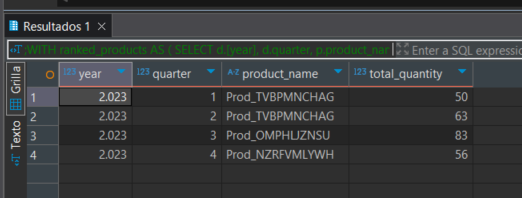

##### ¿Cuáles son las tendencias de compra de los clientes más leales?

```sql
WITH top_clients AS (
  SELECT TOP 5
    c.id_customer,
    c.customer_name,
    SUM(f.total_amount) AS annual_spent
  FROM dwh_innova.fact_invoices AS f
    JOIN dwh_innova.dim_date AS d
      ON f.id_date = d.date_id
    JOIN dwh_innova.dim_customer AS c
      ON f.id_customer = c.id_customer
  WHERE d.[year] = 2024
  GROUP BY
    c.id_customer,
    c.customer_name
  ORDER BY
    SUM(f.total_amount) DESC
)
SELECT
  d.[year],
  d.month,
  tc.customer_name,
  SUM(f.total_amount) AS monthly_spent
FROM dwh_innova.fact_invoices AS f
  JOIN dwh_innova.dim_date AS d
    ON f.id_date = d.date_id
  JOIN top_clients AS tc
    ON f.id_customer = tc.id_customer
GROUP BY
  d.[year],
  d.month,
  tc.customer_name
ORDER BY
  tc.customer_name,
  d.[year],
  d.month;

```

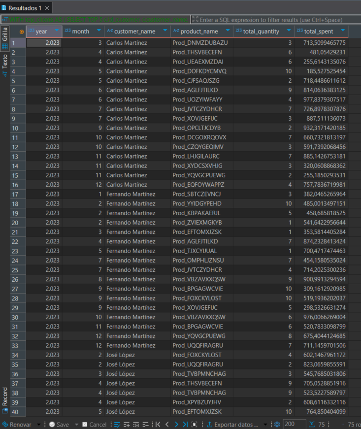

##### ¿Cómo varían las ventas según las regiones geográficas durante el año?

```sql
SELECT
  d.[year],
  d.month,
  l.city             AS region,
  SUM(f.total_amount) AS total_sales
FROM dwh_innova.fact_invoices AS f
  JOIN dwh_innova.dim_date     AS d
    ON f.id_date = d.date_id
  JOIN dwh_innova.dim_customer AS c
    ON f.id_customer = c.id_customer
  JOIN dwh_innova.dim_location AS l
    ON c.id_location = l.id_location
WHERE
  d.[year] = 2023
GROUP BY
  d.[year],
  d.month,
  l.city
ORDER BY
  d.month,
  l.city;

```

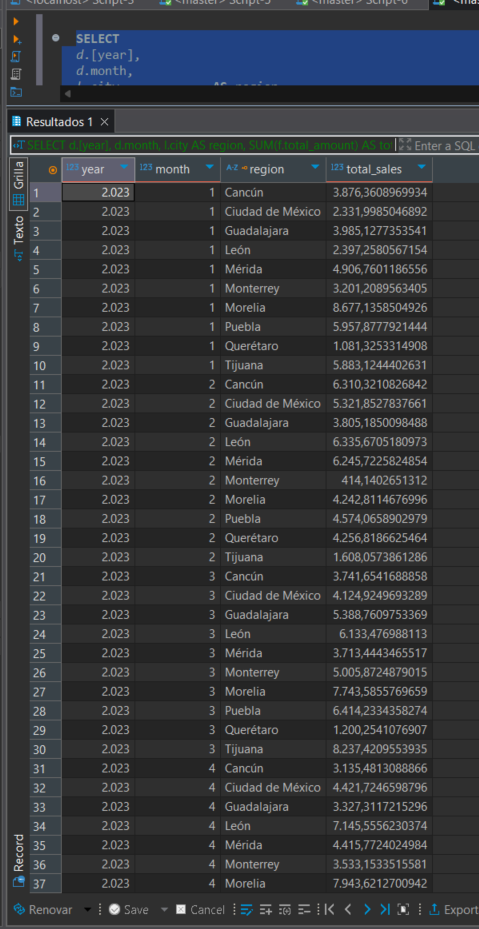

Las respuestas pueden mejorar dependiendo del detalle o nivel que el cliente desee en su análisis. Sin embargo las presentadas son utiles y funcionales para un abordaje inicial.

Estructura del Repositorio `alegra/`

A continuación se detalla la estructura del repositorio:

```txt
.
├── data_lake/                  # Data Lake estructurado por capas (Bronze/Silver)
│   ├── bronze/innova/          # Archivos Parquet crudos por entidad y fecha de carga
│   ├── silver/innova/          # Archivos Parquet transformados (staging) para SQL Server
|   └── gold/innova/            # Archivos Parquet listos para consumo (modelado final, agregaciones)

├── docs/                       # Documentación del modelo lógico
│   ├── images/                 # Diagramas, como el modelo de datos en PNG
│   └── logical_model/          # Exportación del modelo lógico (PowerDesigner u otro)

├── data_source/                # Archivos con la data original (prescindible al conectarlo a data en producción)

├── metadata/                  # Archivos JSON con metadatos por paso del ETL
│   └── innova/
│       ├── step_01__ingest_raw.json
│       └── step_02__transform_and_load_stg.json

├── spark_docker/              # Entorno Dockerizado
│   ├── docker-compose.yml     # Levanta Spark, SQL Server y Jupyter
│   └── jupyter/Dockerfile     # Imagen base con Java 11, PySpark 3.4.1

├── src/innova/                # Lógica principal de ETL y carga al DWH
│   ├── config/                # Configuraciones y DDL para SQL Server
│   │   └── ddl/               # Scripts de creación de dimensiones y hechos
│   ├── etl/                   # Notebooks que ejecutan cada paso del flujo
│   ├── sql/                   # Scripts de MERGE y consultas analíticas (Gold Layer)
│   │   └── gold_analitycs/    # Consultas BI: ventas por región, productos top, etc.
│   ├── utils/                 # Orquestador principal `DataWarehouseLoader`
│   └── populate_dim_date.ipynb # Notebook para cargar `dim_time`

├── utils/                     # Funciones auxiliares y conexión a SQL Server
│   ├── connections/           # BaseConnector y SQLServerConnector
│   ├── spark_helpers.py       # Inicialización y funciones comunes para Spark
│   ├── trackers.py            # Logging y tracking de metadatos
│   └── transform_schema.py    # Casters según esquemas definidos

├── .gitignore
└── README.md
```

## La estructura interna de este repositorio consta de:

### 📁 `data_source/`: Archivos fuente originales

Esta carpeta contiene los archivos CSV que simulan el origen transaccional de los datos. Se trata de tres archivos con estructura fija y predefinida:

* `customers.csv`
* `products.csv`
* `invoices.csv`

Estos archivos se utilizan únicamente como entrada para el pipeline ETL. No se conectan a un motor SQL real ni a una API externa. En la etapa de ingesta (`step_01`), estos datos se copian directamente al área **bronze** del Data Lake sin alteraciones, garantizando trazabilidad y separación de responsabilidades.

---

### 📁 `data_lake/`: Almacenamiento por capas (Bronze, Silver, Gold)

Esta carpeta implementa la estructura del Data Lake bajo el enfoque clásico de **multizonas**:

#### 🟤 `bronze/`

Contiene los datos **crudos** en formato Parquet, directamente derivados de los CSV fuente. Se respeta su estructura original y se particionan por `load_date` para garantizar trazabilidad de las cargas.

* Ubicación típica: `data_lake/bronze/innova/<tabla>/load_date=<timestamp>/`
* Archivos: Parquet `.snappy`, `_SUCCESS`, archivos `.crc` (generados por Spark).

#### ⚪ `silver/`

Aquí se almacenan los datos **transformados** y **normalizados** listos para ser cargados al Data Warehouse. Esta zona representa la capa de *staging* y sigue el esquema lógico definido en los scripts SQL.

* Ubicación: `data_lake/silver/innova/temp_tables/<tabla>_stg/`
* Cambios aplicados:

  * Casting de tipos.
  * Estandarización de nombres de columnas.
  * Limpieza de registros nulos o inconsistentes.

#### 🟡 `gold/`

Contiene las **vistas analíticas y métricas** requeridas por la prueba técnica, listas para consumo por herramientas de BI o consultas de negocio.

* Ubicación: `data_lake/gold/innova/<vista>`
* Aquí se encuentran outputs de queries como:

  * Productos más vendidos por trimestre.
  * Tendencias de compras por cliente.
  * Ventas por región.

Esta estructura permite evolucionar fácilmente hacia esquemas más robustos con integración a catálogos externos o Delta Lake.

---

### 📁 `metadata/`: Trazabilidad y control del pipeline

Esta carpeta almacena archivos JSON generados automáticamente por el pipeline ETL en cada uno de sus pasos. Estos archivos contienen **metadatos esenciales** como:

* Ruta de almacenamiento de cada entidad procesada.
* Timestamp de carga (`load_date`).
* Número total de registros procesados.

#### 📄 Ejemplos:

* `step_01__ingest_raw.json`: generado tras la ingesta a Bronze.
* `step_02__transform_and_load_stg.json`: generado tras la transformación a Silver.

Estos archivos son consumidos por etapas posteriores del pipeline para:

* Evitar hardcodeos de rutas.
* Validar volumenes de datos entre etapas.
* Registrar logs estructurados del proceso.

Este enfoque modular y trazable demuestra una **arquitectura robusta y escalable**, propia de entornos reales de producción.

---

### 📁 `spark_docker/`: Entorno reproducible con Docker

Este directorio contiene la infraestructura necesaria para levantar el entorno completo de desarrollo de manera aislada, sin depender de servicios externos. Se compone de:

#### 📄 `docker-compose.yml`

Define los servicios que componen el stack técnico del proyecto:

* **Spark + Jupyter**: nodo maestro con PySpark 3.4.1, Java 11 y JupyterLab como interfaz.
* **SQL Server**: contenedor que emula una base de datos OLTP para almacenar el Data Warehouse.

Este archivo permite levantar todo con:

```bash
docker-compose up -d
```

#### 📄 `jupyter/Dockerfile`

Construye la imagen base del contenedor Spark. Incluye:

* Python 3.10
* Java 11
* Apache Spark 3.4.1
* Paquetes requeridos (`pyspark`, `pyodbc`, etc.)

Esto permite ejecutar notebooks PySpark de forma local, conectándose a SQL Server dentro del mismo entorno.

---

### 📁 `src/innova/config/`: Configuración y definición del modelo físico

Contiene los archivos necesarios para parametrizar el pipeline y definir la estructura del Data Warehouse en SQL Server.

* `config.py`: centraliza rutas, esquemas y nombres de tablas usados en el pipeline.
* `ddl/`: colección de scripts `.sql` que crean las tablas del modelo tipo **copo de nieve** (dimensiones y hechos). Estos scripts son ejecutados automáticamente durante la carga al DWH.

#### 📄 `etl_config.yml`: Configuración declarativa del pipeline ETL

Este archivo YAML representa el corazón de la parametrización del proyecto. Define:

* Las **capas del Lakehouse** (`bronze`, `silver`, `gold`).
* Las **rutas físicas** de trabajo: data lake, logs, metadata y fuentes.
* El  **orden y habilitación de pasos ETL** , permitiendo orquestación dinámica.
* El  **esquema detallado de cada tabla fuente** , especificando tipos estrictos.
* La  **lógica de modelado DWH** , incluyendo mapeos de columnas, claves naturales y relaciones foráneas (`fk_map`).

Este enfoque permite desacoplar la lógica de implementación del flujo ETL de su configuración, facilitando la extensibilidad hacia nuevos negocios sin tocar el código fuente.

---

### 📁 `src/innova/etl/`: Pipeline ETL modular con PySpark

Esta carpeta contiene los notebooks que implementan cada etapa del pipeline. Cada notebook es independiente, recibe sus parámetros desde `etl_config.yml`, y deja trazabilidad en forma de metadatos (`metadata/*.json`) y logs.

Contiene los archivos necesarios para parametrizar el pipeline y definir la estructura del Data Warehouse en SQL Server.

* `config.py`: centraliza rutas, esquemas y nombres de tablas usados en el pipeline.
* `ddl/`: colección de scripts `.sql` que crean las tablas del modelo tipo **copo de nieve** (dimensiones y hechos). Estos scripts son ejecutados automáticamente durante la carga al DWH.

#### 📄 `etl_config.yml`: Configuración declarativa del pipeline ETL

Este archivo YAML representa el corazón de la parametrización del proyecto. Define:

* Las **capas del Lakehouse** (`bronze`, `silver`, `gold`).
* Las **rutas físicas** de trabajo: data lake, logs, metadata y fuentes.
* El  **orden y habilitación de pasos ETL** , permitiendo orquestación dinámica.
* El  **esquema detallado de cada tabla fuente** , especificando tipos estrictos.
* La  **lógica de modelado DWH** , incluyendo mapeos de columnas, claves naturales y relaciones foráneas (`fk_map`).

Este enfoque permite desacoplar la lógica de implementación del flujo ETL de su configuración, facilitando la extensibilidad hacia nuevos negocios sin tocar el código fuente.

#### 📓 `stp_01__ingest_data.ipynb`: Ingesta cruda a Bronze

Este notebook realiza la ingesta inicial de los archivos CSV desde `data_source/`, y los guarda en la zona **bronze** del Data Lake en formato Parquet, respetando su estructura original.

* Lee configuración dinámica de tablas desde `etl_config.yml`.
* Crea particiones `load_date=<timestamp>` por entidad (`customers`, `products`, `invoices`).
* Genera el archivo de metadata `step_01__ingest_raw.json` con ruta y conteo de registros.

**Objetivo:** preservar los datos fuente sin alteraciones para garantizar trazabilidad y facilitar reprocesos.

#### 📓 `stp_02__load_stg_tables.ipynb`: Transformación y carga a Staging

Este paso lee los datos de Bronze, los transforma y los deja listos en la base de datos SQL Server como tablas de staging.

* Aplica filtros y casting estricto según los esquemas definidos en el config.
* Escribe los datos transformados en:

  * Parquet (zona `silver/temp_tables`).
  * SQL Server (`silver_prod.temp_tables.*`) con conexión vía `SQLServerConnector`.
* Registra el proceso en `step_02__transform_and_load_stg.json`.

**Objetivo:** estandarizar los datos y prepararlos para alimentar el modelo dimensional del DWH.

#### 📓 `stp_03__make_dwh.ipynb`: Construcción del modelo de datos

Este notebook ejecuta el proceso de carga del Data Warehouse, basado en el modelo copo de nieve propuesto.

* Lee los datos staging desde `step_02__transform_and_load_stg.json`.
* Usa la clase `DataWarehouseLoader` para:

  * Ejecutar los scripts DDL de creación de tablas (`dim_*`, `fact_*`).
  * Resolver claves foráneas.
  * Hacer `MERGE` (upserts) desde staging a las tablas del DWH.
* Se apoya en configuración desde `etl_config.yml`.

**Objetivo:** materializar el modelo de datos completo en SQL Server y garantizar su consistencia referencial.

#### 📓 `stp_04__make_bi.ipynb`: Generación de vistas analíticas (Gold)

Notebook final del pipeline que prepara la capa Gold con consultas analíticas derivadas del modelo DWH.

* Configura conexiones y rutas necesarias.
* Las vistas o tablas resultantes se generan mediante los scripts SQL en `src/innova/sql/gold_analitycs/`.
* Incluye análisis como:

  * Clientes leales por volumen de compras.
  * Productos más vendidos por trimestre.
  * Tendencias regionales de ventas.

**Objetivo:** facilitar la lectura de métricas de negocio solicitadas en la prueba, listas para consumo por analistas o herramientas BI.

---

### 📁 `src/innova/sql/`: Lógica SQL del Data Warehouse y capa analítica

Esta carpeta contiene todos los scripts SQL que complementan el pipeline PySpark. Se dividen en dos grupos:

#### Scripts de carga al DWH

Ubicados en la raíz de esta carpeta, estos scripts ejecutan operaciones `MERGE` para poblar las tablas del modelo copo de nieve desde las tablas staging (`silver_prod.temp_tables.*`).

| Script                                        | Descripción                                                           |
| --------------------------------------------- | ---------------------------------------------------------------------- |
| `dwh_innova_dim_customer_merge.sql`         | Inserta y actualiza clientes en `dim_customer`.                      |
| `dwh_innova_dim_location_merge.sql`         | Pobla `dim_location`.                                                |
| `dwh_innova_dim_segment_merge.sql`          | Inserta segmentos únicos de cliente.                                  |
| `dwh_innova_dim_product_merge.sql`          | Carga productos, resolviendo la categoría asociada.                   |
| `dwh_innova_dim_product_category_merge.sql` | Crea o actualiza categorías en `dim_product_category`.              |
| `dwh_innova_fact_invoices_merge.sql`        | Carga la tabla de hechos `fact_invoices`, resolviendo todas las FKs. |

Todos estos scripts son ejecutados automáticamente desde el notebook `stp_03__make_dwh.ipynb` mediante la clase `DataWarehouseLoader`.

#### `gold_analitycs/`: Consultas analíticas (capa Gold)

Contiene los scripts que generan vistas analíticas directamente sobre el modelo DWH. Estas consultas responden a los KPIs solicitados en la prueba.

| Script                                  | Métrica o pregunta respondida                                    |
| --------------------------------------- | ----------------------------------------------------------------- |
| `loyal_customers_purchase_trends.sql` | ¿Cuáles son los clientes más leales y qué productos compran?  |
| `sales_by_region_trends.sql`          | ¿Cómo varían las ventas según la región a lo largo del año? |
| `top_selling_product_by_quarter.sql`  | ¿Cuál es el producto más vendido por trimestre?                |

Estas consultas pueden desplegarse como vistas materializadas o servir como insumo para dashboards de negocio.

---

### 📁 `src/innova/utils/loader.py`: Orquestador de carga al Data Warehouse

Este archivo implementa la clase `DataWarehouseLoader`, núcleo del paso `step_03`, responsable de construir y poblar el modelo de datos en SQL Server.

#### ¿Qué hace?

* Ejecuta la carga completa del **modelo copo de nieve**, resolviendo la secuencia correcta de inserción.
* Controla la inserción de dimensiones simples, dimensiones con claves foráneas, y la tabla de hechos.
* Usa archivos SQL externos (`*_merge.sql`) para ejecutar upserts vía `MERGE`.

#### Características técnicas:

* **Carga topológica:** calcula automáticamente el orden correcto de carga entre entidades, respetando dependencias de claves foráneas.
* **Soporte para staging:** usa tablas temporales (`stg_*`) para staging interno antes de hacer `MERGE`.
* **Resuelve FKs dinámicamente:** realiza joins contra dimensiones ya cargadas o consultadas desde SQL.
* **Cache de dimensiones:** evita recargas innecesarias gracias a un sistema de cache interno (`_dim_cache`).
* **Diseño desacoplado:** toma la configuración desde `etl_config.yml`, permitiendo definir cada entidad (select, natural keys, FKs, SQL path) sin tocar el código.

#### Flujo de ejecución (método `run()`):

1. Determina orden de carga (`_topological_order`).
2. Carga primero dimensiones *lookup* (sin FKs).
3. Luego dimensiones dependientes (`_resolve_fk`).
4. Finalmente, carga la tabla de hechos (`fact_invoices`) usando la misma lógica.

---

### 📓 `populate_dim_date.ipynb`: Generación de la dimensión de tiempo (`dim_time`)

Este notebook construye y carga la dimensión `dim_date` en el esquema `dwh_innova`, abarcando el año 2023. Es una tabla auxiliar indispensable en cualquier modelo dimensional, ya que permite realizar análisis temporales (por mes, trimestre, fin de semana, etc.).

### 📁 `utils/`: Utilidades compartidas del pipeline ETL

Este módulo agrupa componentes reutilizables que soportan toda la ejecución del pipeline. Permiten desacoplar la lógica de negocio de aspectos técnicos como configuración, casting de esquemas, conexiones a bases de datos, logging y ejecución Spark.

Incluye funciones puras, conectores, utilitarios para casting estricto de tipos y carga dinámica de configuración, todos usados en múltiples etapas (`step_01` a `step_04`) para garantizar consistencia y trazabilidad.

#### 📄 `utils/config.py`: Cargador centralizado de configuración

Este módulo define una única función: `load_etl_config`, que se encarga de leer el archivo `etl_config.yml` correspondiente a un negocio determinado (por ejemplo, `innova`).

* Busca el archivo en la ruta: `src/<business>/config/etl_config.yml`.
* Carga el contenido como diccionario Python utilizando `yaml.safe_load`.
* Si el archivo no existe, lanza un error explícito.

#### 📄 `utils/spark_helpers.py`: Utilidades para manejo de Spark y archivos Parquet

Este módulo proporciona funciones auxiliares para facilitar tareas comunes en Spark durante la ejecución del pipeline, especialmente en las etapas de ingesta y transformación.

#### ¿Qué ofrece?

* **Lectura y escritura de archivos Parquet:**

  * `load_parquet`: carga segura de archivos Parquet, con logging y manejo de errores.
  * `save_parquet`: guarda un `DataFrame` con control de modo (`overwrite`) y partición.
* **Carga y escritura de metadatos:**

  * `load_metadata` / `save_metadata`: lectura y persistencia de archivos JSON que contienen información clave por paso del pipeline (rutas, conteos, timestamps).
* **Ejecución de consultas SQL desde archivo:**

  * `execute_query`: ejecuta una query guardada en disco como archivo `.sql` usando Spark SQL, incluyendo logging detallado.
* **Registro de vistas temporales:**

  * `register_temp_view`: permite exponer un `DataFrame` como vista temporal en Spark para consultas encadenadas.

**Utilidad:**
Estas funciones abstraen operaciones repetitivas, aseguran consistencia en el manejo de errores y facilitan el desarrollo de notebooks más limpios y reutilizables.

#### 📄 `utils/trackers.py`: Logging estructurado y gestión de metadatos

Este módulo facilita el seguimiento estructurado del pipeline mediante logs persistentes y generación automática de archivos de metadatos por paso.

#### ¿Qué incluye?

* **`setup_logging(log_path)`**
  Inicializa un logger de nivel `INFO` que escribe en un archivo fijo (`etl.log`). Asegura que los logs de ejecución queden registrados y reutiliza una única instancia de logger para todo el pipeline.
* **`log_and_register(...)`**
  Componente clave durante la ingesta (`step_01`):

  * Cuenta registros.
  * Guarda el `DataFrame` como Parquet.
  * Actualiza el diccionario de metadatos con `path`, `load_date` y `record_count`.
* **`save_metadata(...)`**
  Persiste el diccionario generado en el paso anterior como archivo `.json` en la carpeta `metadata/`, nombrado según el nombre del paso (`step_01`, `step_02`, etc.).

**Utilidad:**
Este archivo centraliza todo el control de **auditoría y trazabilidad** del pipeline, permitiendo mantener registros consistentes por paso, detectar errores y facilitar debugging o reintentos parciales.

#### 📄 `utils/transform_schema.py`: Aplicación de esquemas estrictos

Este módulo define la función `apply_strict_schema`, utilizada durante el paso de transformación (`step_02`) para garantizar que cada columna del `DataFrame` tenga el tipo de dato correcto antes de ser persistido o cargado en staging.

#### ¿Qué hace?

* Recibe un `DataFrame` y un diccionario de esquema (`schema_dict`) que define el tipo esperado de cada columna.
* Castea explícitamente cada columna a:

  * `StringType`
  * `LongType`
  * `IntegerType`
  * `DateType` (en formato `"yyyy-MM-dd"`)
  * `DecimalType(precision, scale)`
* Permite extenderse fácilmente para soportar más tipos Spark (`BooleanType`, `TimestampType`, etc.).

**Utilidad:**
Esta función asegura que los datos cumplen con la estructura esperada del modelo dimensional antes de ser cargados al DWH, evitando errores en tiempo de ejecución y asegurando integridad en la persistencia.

---

#### 📄 `utils/connections/base_connector.py`: Interfaz abstracta para conectores de bases de datos

Este archivo define la clase `BaseConnector`, una clase abstracta que sirve como contrato base para cualquier conector de base de datos que se desee implementar en el pipeline.

#### ¿Qué contiene?

Una interfaz con los siguientes métodos abstractos:

* `connect()`: inicializa la conexión.
* `close()`: cierra y limpia los recursos de la conexión.
* `execute_sql(sql, options)`: ejecuta una consulta SQL y retorna un `DataFrame`.
* `write_dataframe(df, table, mode, options)`: escribe un `DataFrame` en una tabla destino, configurable en modo (`overwrite`, `append`, etc.).

**Utilidad:**
Este diseño permite implementar conectores específicos para distintos motores (SQL Server, PostgreSQL, Snowflake, etc.) cumpliendo con la misma interfaz, lo que facilita el mantenimiento y la extensión del pipeline en contextos reales.

#### 📄 `utils/connections/sql_server_connector.py`: Conector híbrido a SQL Server

Este archivo implementa la clase `SQLServerConnector`, una extensión de `BaseConnector`, que facilita la interacción con SQL Server tanto para lectura como escritura de datos.

#### ¿Qué ofrece?

* **Autoconfiguración flexible:**

  * Puede tomar los parámetros de conexión desde variables de entorno (`SQLSERVER_HOST`, etc.) o un diccionario `config`.
  * Soporta encriptación y configuración segura por defecto.
* **Conexión híbrida (PySpark + pyodbc):**

  * Lectura de datos como `DataFrame` vía `Spark JDBC`.
  * Ejecución de DDL/DML vía `pyodbc`, útil para scripts `MERGE`, `DROP`, etc.
* **Operaciones clave:**

  * `execute_sql(...)`: ejecuta consultas como `SELECT` (Spark) o `INSERT`, `UPDATE`, `MERGE` (pyodbc).
  * `write_dataframe(...)`: escribe un `DataFrame` a una tabla destino mediante JDBC.
  * `drop_table(...)`: elimina tablas si existen.
  * `upsert(...)`: función de alto nivel que:

    1. Carga datos en tabla `staging`.
    2. Lee plantilla SQL `MERGE`.
    3. Ejecuta la lógica `MERGE` en destino utilizando `sp_executesql`.

**Utilidad:**
Este conector simplifica y unifica el manejo de datos con SQL Server, permitiendo realizar cargas completas, actualizaciones, validaciones y pruebas desde notebooks PySpark con una sola clase reutilizable.

---

## Reflexión Final y Valor de esta Solución

Este proyecto no solo cumple con los requisitos técnicos de la prueba, sino que también demuestra una **visión realista de implementación en entornos productivos**.

Se implementó una arquitectura completa que simula un entorno de tipo Lakehouse, incluyendo:

* **Procesamiento distribuido real** con PySpark.
* **Persistencia y trazabilidad** con metadatos estructurados y logs detallados.
* **Cargas incrementales al DWH** usando SQL Server real en contenedor.
* **Modularidad y escalabilidad**, con soporte multinegocio desde la raíz del pipeline.

Además de resolver correctamente los puntos solicitados, se adoptaron **prácticas de ingeniería de datos robustas**, como separación por capas (`bronze/silver/gold`), abstracciones reutilizables, versionado de estructuras (`DDL`) y automatización de procesos críticos (`MERGE`, `upsert`, etc.).

---

Esta solución está pensada no solo como una respuesta a un reto técnico, sino como una **base reutilizable y adaptable a múltiples escenarios empresariales reales**.
Gracias por revisar este trabajo — ¡quedo atento a cualquier mejora o desafío futuro!
